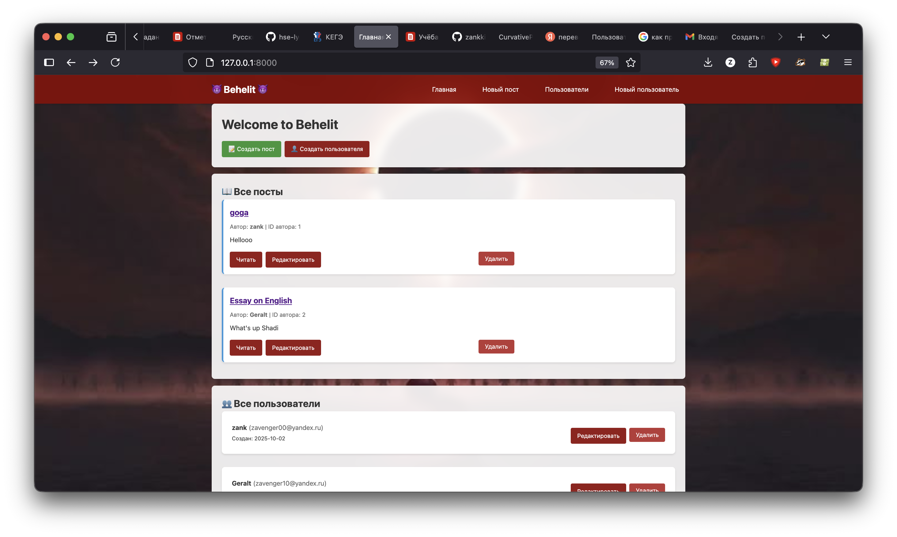
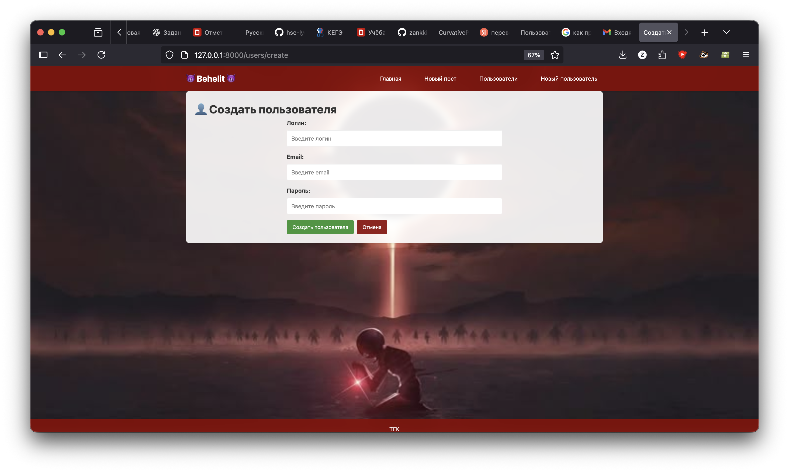
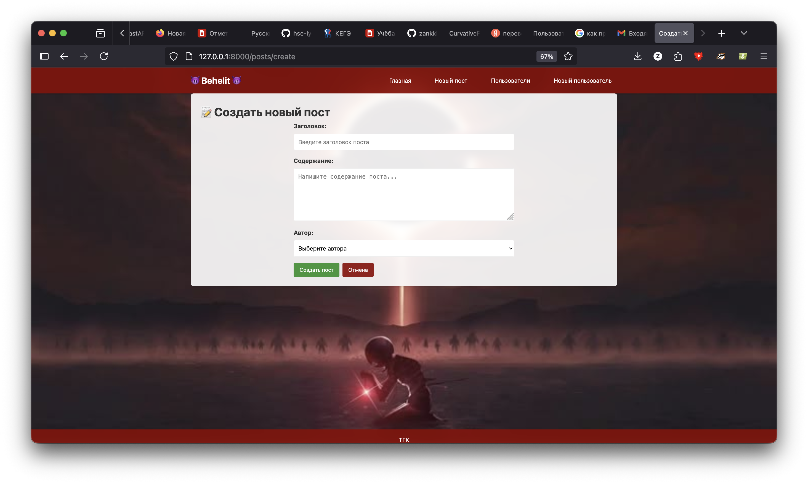
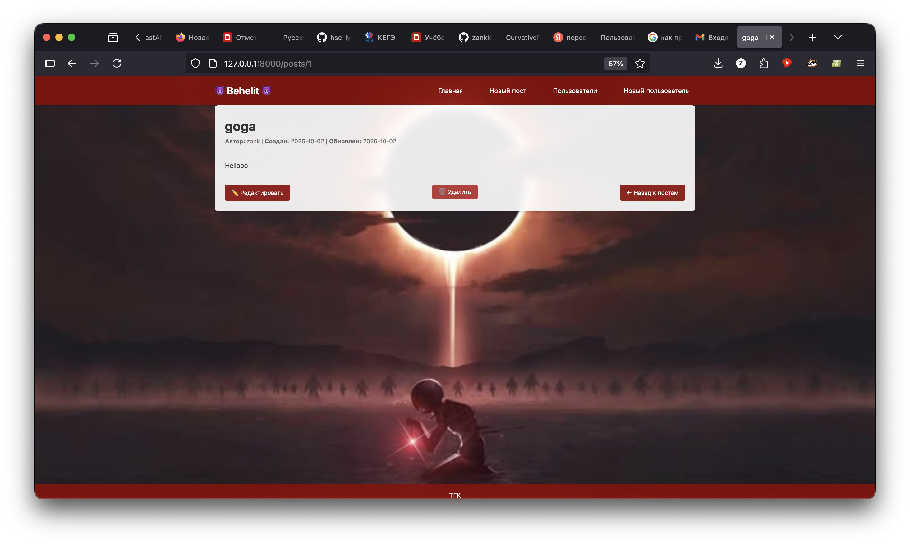
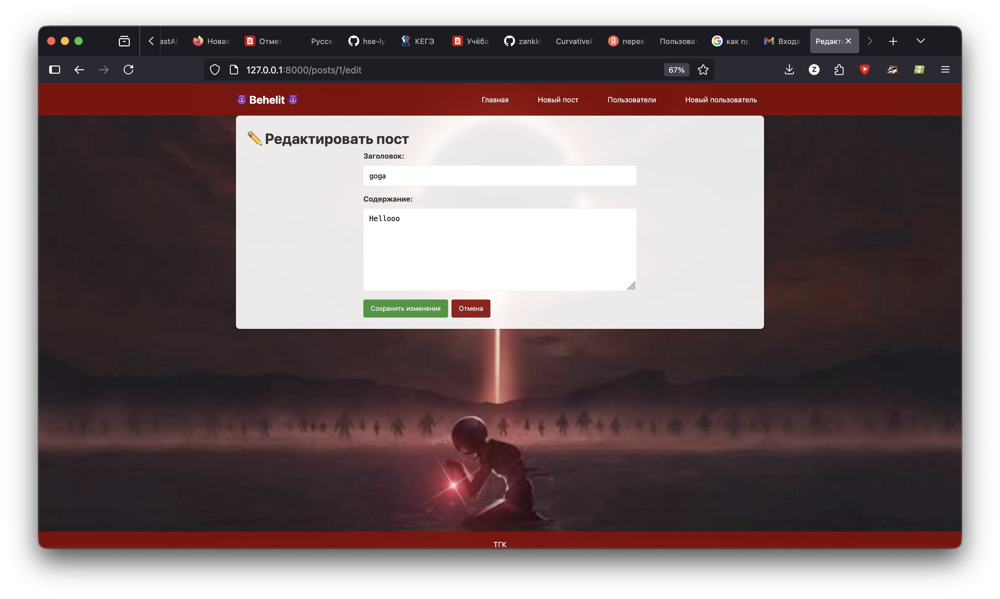
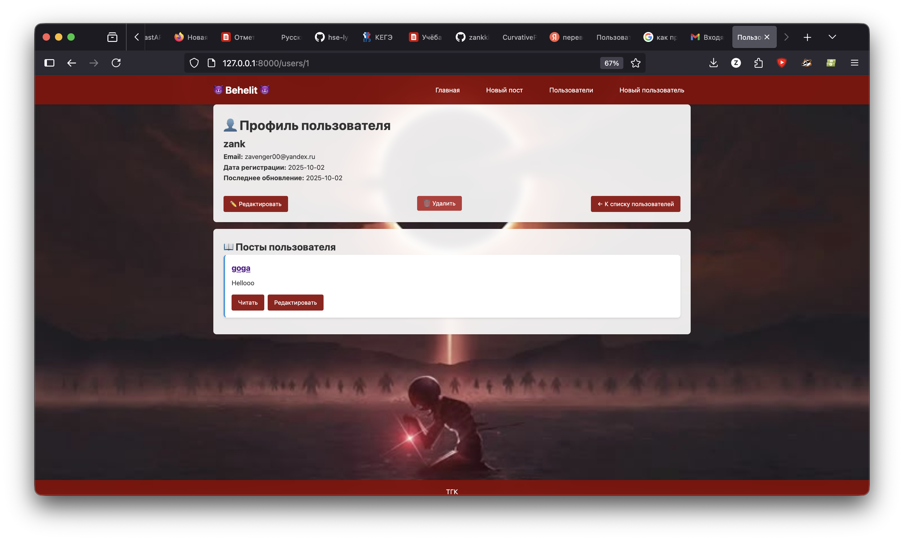
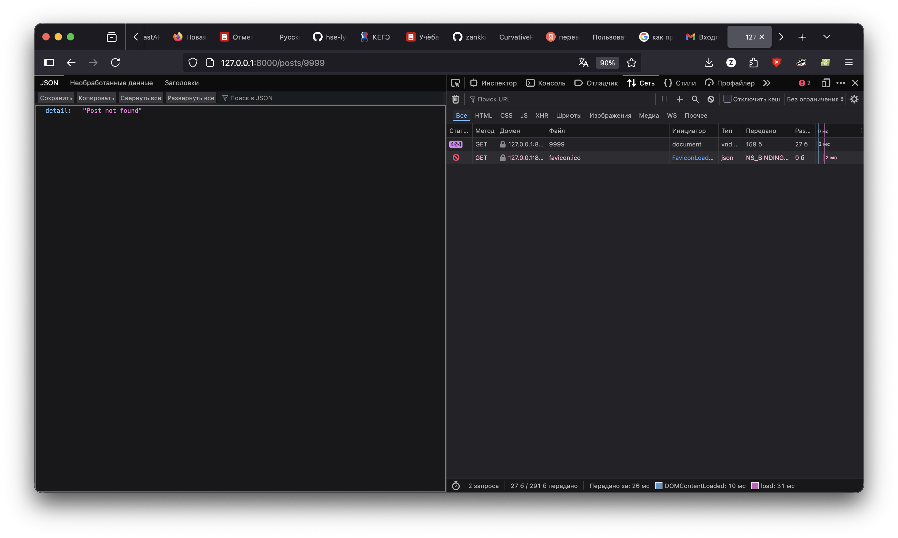
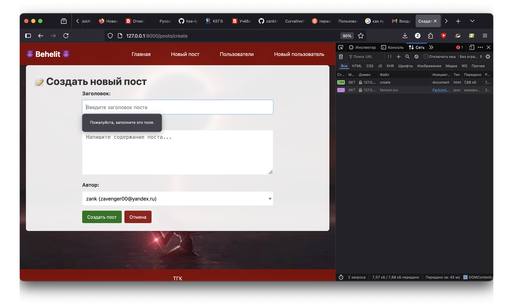
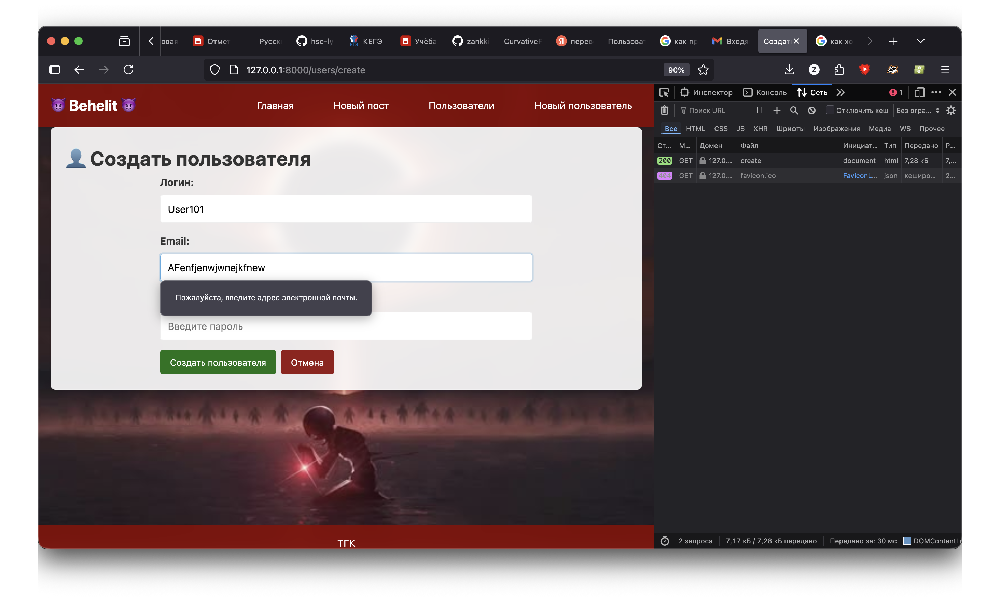
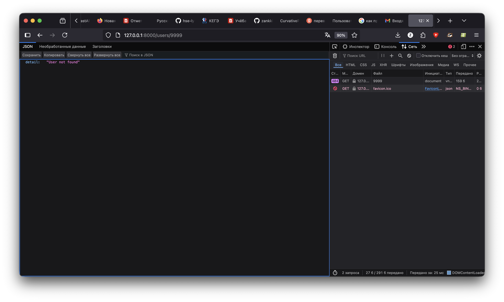

# hse-lyceum-web-2025-project
dz-web
Hi, its my project.

# Behelit

### Успешные сценарии

#### 1. Главная страница

*Главная страница со списком всех постов и пользователей*

#### 2. Создание пользователя

*Форма создания нового пользователя*

#### 3. Создание поста

*Форма создания нового поста с выбором автора*

#### 4. Просмотр поста

*Страница просмотра поста с действиями редактирования и удаления*

#### 5. Редактирование поста

*Форма редактирования существующего поста*

#### 6. Профиль пользователя

*Страница профиля пользователя с его постами*

### Сценарии с ошибками

#### 1. Несуществующий пост (404)

*Ошибка 404 при попытке открыть несуществующий пост*

#### 2. Пустые поля формы

*Обязательные поля не заполнены*

#### 3. Неверный  формат

*Некорректный формат email адреса*

#### 3. Неверный  формат

*Некорректный формат email адреса*

## Запуск
```zsh
cd blog-api
python -m venv .venv
source .venv/bin/activate
pip install -r requirements.txt
uvicorn main:app --reload
```
## Структура
main.py - FastAPI приложение
storage.py - работа с данными
templates/ - HTML шаблоны
data.json - хранение данных

## Функциональность
CRUD операции для пользователей и постов
Валидация данных через Pydantic
Хранение данных в JSON файле
Веб-интерфейс с HTML формами
Обработка ошибок (404, валидация)
Адаптивный дизайн с CSS

## Технологии
Backend: FastAPI, Uvicorn
Frontend: HTML, CSS, Jinja2
База данных: JSON файловая система
Валидация: Pydantic
Стили: Pure CSS

Author
    Zakhar